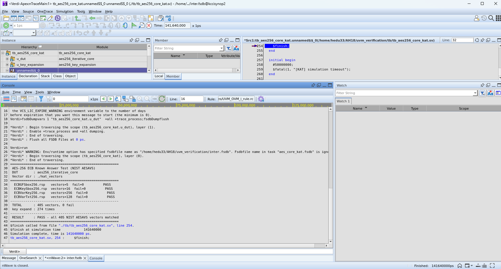
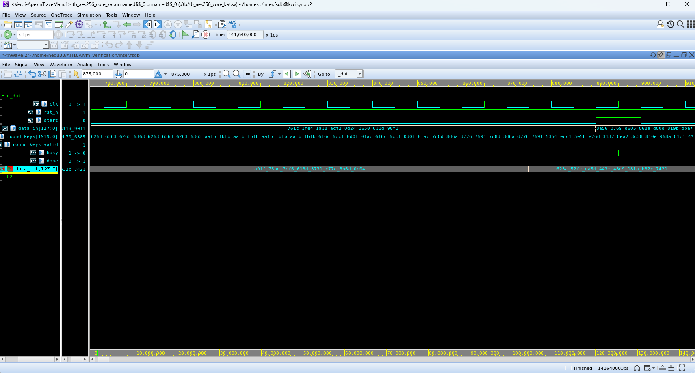

# AES-256-GCM Block-Parallel Core

128비트 AXI4-Stream 데이터 경로를 사용하는 standalone AES-256-GCM TX/RX RTL입니다. 하나의 반복형 AES-256 엔진과 하나의 순차 GHASH 엔진을 블록 단위로 중첩 실행합니다.

## 설계 구성

```text
AES256_GCM_Core/
├── rtl/
│   ├── aes256_gcm_top.sv          TX/RX 통합 top
│   ├── aes256_gcm_tx_wrapper.sv   AAD 처리, CTR 암호화, GHASH, TAG 출력
│   ├── aes256_gcm_rx_wrapper.sv   TAG 검증, 오류 검사, 인증 평문 버퍼
│   ├── aes256_core.sv             반복형 AES-256 및 라운드 키 캐시
│   ├── aes_*.sv                   AES 라운드 연산 모듈
│   ├── ghash_engine_seq.sv        순차 GHASH 제어
│   └── gf128_mult_8bit_seq.sv     8비트 단위 GF(2^128) 곱셈기
├── tb/
│   └── tb_aes256_gcm.sv           GCM TX/RX 통합 테스트벤치
└── verification/nist_aes256_kat/
    ├── kat_vectors/               NIST AESAVS AES-256 ECB 벡터
    ├── tb/                        현재 코어용 및 VCS 원본 구조용 TB
    ├── sim/                       Vivado xsim 실행 스크립트
    └── results/                   xsim/VCS 로그와 Verdi 화면
```

최상위 모듈은 `aes256_gcm_top`입니다. TX와 RX를 분리해 사용할 때는 각각 `aes256_gcm_tx_wrapper`, `aes256_gcm_rx_wrapper`를 top으로 지정합니다.

현재 `aes256_gcm_top.sv`는 TX/RX 암호 연산에 `FIXED_KEY` parameter를 연결합니다. `tx_key`와 `rx_key` 입력 포트는 예약 상태이며 현재 데이터 경로에서는 사용하지 않습니다.

## 패킷과 GCM 입력

한 패킷은 128비트 AXI beat 82개, 총 1,312바이트입니다.

```text
[AAD 1 beat][Payload 또는 Ciphertext 80 beats][Authentication Tag 1 beat]
     16 B                         1,280 B                         16 B
```

AAD 비트 배치는 다음과 같습니다.

```text
[Session ID 32][Frame Counter 32][Packet Counter 32][Reserved 28][EOF][SOF][Frame1][Frame0]
```

- 96비트 IV: `AAD[127:32]`
- 초기 카운터 블록: `J0 = {IV, 32'd1}`
- Payload CTR 시작값: `2`
- GCM 길이 블록: `{64'd128, 64'd10240}`

현재 RTL은 AAD 1블록과 Payload 80블록을 고정 형식으로 처리합니다.

## 블록 병렬 처리

AES 라운드를 전개하거나 AES 코어를 복제하지 않고 AES와 GHASH가 서로 다른 연산을 동시에 수행하도록 스케줄링합니다.

| 처리 구조 | AES 지연 | GHASH 지연 | 블록당 예상 지연 |
|---|---:|---:|---:|
| 순차 실행 | 약 14 cycles | 약 16 cycles | 약 30 cycles |
| 중첩 실행 | 동시 실행 | 동시 실행 | 약 16 cycles |

80블록 패킷의 구조적 예상 처리시간은 약 2,500 cycles에서 약 1,300 cycles로 감소합니다. 실제 처리율에는 AXI backpressure와 시스템 클럭이 함께 반영됩니다.

### TX 데이터 경로

첫 키스트림을 미리 계산한 뒤 현재 암호문의 GHASH와 다음 CTR 블록의 AES를 겹칩니다.

```text
초기 단계       : AES(CTR_0) -> 첫 번째 keystream
Payload block i : GHASH(C_i) || AES(CTR_i+1)
출력            : C_i = P_i XOR keystream_i
```

이 스케줄은 `aes256_gcm_tx_wrapper.sv`의 `T_PAYLOAD_PARALLEL_START` 및 `T_PAYLOAD_PARALLEL_WAIT` 상태에서 제어됩니다.

### RX 데이터 경로

수신 암호문은 같은 시점에 AES CTR 경로와 GHASH 경로로 전달됩니다.

```text
Ciphertext C_i --+-- AES(CTR_i) -> keystream_i -> P_i
                 +-- GHASH(C_i) -> authentication state
```

두 연산이 완료되면 다음 블록으로 진행하며, 인증 태그가 일치한 라인만 평문 출력으로 전달합니다.

## AES-256 NIST KAT 검증

`verification/nist_aes256_kat/`의 테스트벤치는 NIST AESAVS AES-256 ECB Known-Answer Test 벡터를 읽어 AES 블록 암호화 결과를 비교합니다.

| 벡터 파일 | 벡터 수 | 검사 범위 |
|---|---:|---|
| `ECBGFSbox256.rsp` | 5 | S-box 기본 동작 |
| `ECBKeySbox256.rsp` | 16 | AES-256 키 확장 경로 |
| `ECBVarKey256.rsp` | 256 | 256비트 키 입력 변화 |
| `ECBVarTxt256.rsp` | 128 | 128비트 평문 입력 변화 |
| 합계 | **405** | AES-256 ECB 암호화 |

### 보존된 검증 결과

| DUT | 시뮬레이터 | 결과 | 실행일 |
|---|---|---:|---|
| 현재 [`rtl/aes256_core.sv`](rtl/aes256_core.sv) | Vivado xsim 2025.2 | **405 pass, 0 fail** | 2026-08-17 |
| `aes256_iterative_core`와 분리형 키 확장 검증 구조 | Synopsys VCS W-2024.09-SP1 | **405 pass, 0 fail** | 2026-08-13 |

현재 코어의 xsim 검증은 [`tb_aes256_core_kat_current.sv`](verification/nist_aes256_kat/tb/tb_aes256_core_kat_current.sv)와 [`aes256_core_xsim_20260817.txt`](verification/nist_aes256_kat/results/aes256_core_xsim_20260817.txt)에 대응합니다.

VCS/Verdi 결과는 [`vcs_original/tb_aes256_core_kat.sv`](verification/nist_aes256_kat/tb/vcs_original/tb_aes256_core_kat.sv)가 인스턴스화하는 `aes256_iterative_core` 및 분리형 키 확장 구조에 대응합니다. 현재 `rtl/aes256_core.sv`와 DUT 구성은 다르므로 두 결과를 구분해야 합니다.

- [VCS 전체 실행 로그](verification/nist_aes256_kat/results/vcs_aes256_iterative_core_20260813.txt)
- VCS compiler/runtime: `W-2024.09-SP1_Full64`
- Verdi: `W-2024.09-SP2`





### KAT 판정 기준

전체 검증의 합격 조건은 정확히 405개 벡터와 불일치 0개입니다. 보존된 결과 로그의 최종 판정은 다음과 같습니다.

```text
TOTAL      : 405 vectors, 0 fail
RESULT     : PASS - all 405 NIST AESAVS vectors matched
```

## GCM TX/RX 통합 검증

[`tb/tb_aes256_gcm.sv`](tb/tb_aes256_gcm.sv)는 80블록 패킷 두 개를 TX에 입력하고 생성된 암호 패킷을 RX로 전달합니다.

검사 항목은 다음과 같습니다.

- `[AAD][Ciphertext][TAG]` 형식과 AXI4-Stream handshake
- 두 패킷의 평문 160블록 왕복 일치
- 암호문 및 인증 태그 기준값 비교
- 패킷과 라인 경계의 `TLAST`
- 동일 세션 키에서 TX/RX 라운드 키 캐시 재사용
- 태그 인증 후 평문 라인 출력 및 timeout

통합 테스트 합격 시 로그에 다음 판정문이 출력됩니다.

```text
[TB][PASS] AES-256-GCM line test passed
```

## 트러블슈팅

### RX 초기화 완료 펄스 불일치

초기 RX 구조는 AES와 GHASH를 동시에 시작한 뒤 `aes_done && ghash_done`이 같은 클럭에 성립하기를 기다렸습니다. 두 엔진의 지연 시간이 다르고 `done`은 각각 1클럭 펄스이므로 두 신호가 겹치지 않았고, RX가 `R_INIT_WAIT`에서 정지하면서 TX/RX loopback 전체가 멈추는 문제가 발생했습니다.

현재 RTL은 `init_aes_done_reg`와 `init_ghash_done_reg`에 각 완료 펄스를 독립적으로 저장합니다. 이후 `(aes_done || init_aes_done_reg) && (ghash_done || init_ghash_done_reg)` 조건으로 양쪽 완료를 확인해 다음 상태로 전이합니다. TX의 병렬 payload 처리도 같은 방식으로 서로 다른 AES/GHASH 완료 시점을 결합합니다.

### 인증 전 평문 출력

초기 RX는 AES-CTR로 복원한 평문을 태그 검증 전에 외부로 출력했습니다. 이 구조에서는 잘못된 TAG를 가진 패킷의 평문도 downstream으로 전달될 수 있었습니다.

현재 RX는 두 패킷의 평문 160블록을 `plaintext_line_buffer`에 저장합니다. 짝수 Packet Counter 패킷과 그 다음 홀수 패킷이 모두 인증되고 Frame Counter와 패킷 순서가 일치할 때만 `R_LINE_OUT`에서 160블록을 출력합니다. TAG, 세션, 순서 또는 길이 검사가 실패하면 `first_packet_valid`를 지우고 버퍼 내용을 외부로 내보내지 않습니다.

### 고정 길이와 TLAST 불일치

초기 TX는 조기 `s_axis_tlast`로 payload를 끝낼 수 있었지만 GHASH LEN 블록은 항상 AAD 128 bits, payload 10,240 bits로 계산했습니다. 조기 종료 시 실제 암호문 길이와 인증 길이가 달라져 표준 GCM TAG 및 RX 기대 길이와 일치하지 않았습니다.

현재 TX payload 종료는 `payload_cnt == 79`로 고정되며 입력 `s_axis_tlast`로 길이를 단축하지 않습니다. RX는 AAD나 80개 Ciphertext 블록에서 `TLAST`가 들어오면 `length_err`로 폐기하고, TAG 블록에서만 `TLAST=1`을 허용합니다. 따라서 upstream은 TX에 정확히 80개의 유효 payload beat를 공급해야 합니다.

### 반복 키 확장으로 인한 지연

초기 AES 코어는 동일한 세션 키를 사용하는 `H`, `J0`와 모든 CTR 블록마다 13-cycle AES-256 키 확장을 다시 수행했습니다. 현재 `aes256_core.sv`는 전체 라운드 키를 저장하고 `round_keys_valid && key == key_reg`이면 확장을 건너뜁니다. 통합 테스트벤치는 동일 세션에서 TX/RX 라운드 키가 한 번만 확장되는지 확인합니다.

### 첫 패킷 Anti-Replay 초기값

저장된 Frame/Packet Counter만으로 비교하면 reset 직후의 초기값과 실제 이력 값을 구분하기 어려워 첫 번째 counter 0 패킷이 실행 시점에 따라 다르게 판정될 수 있었습니다. 현재는 `history_valid`가 설정된 뒤에만 replay 및 packet-loss 비교를 수행하고, 인증을 통과한 패킷에서 이력과 valid를 함께 갱신합니다.

## 설계 문서

- [AES Summary](../_docs/AES_GCM/AES_Summary.pdf)
- [GCM Mode](../_docs/AES_GCM/GCM_Mode.pdf)
- [GCM Summary](../_docs/AES_GCM/GCM_Summary.pdf)
